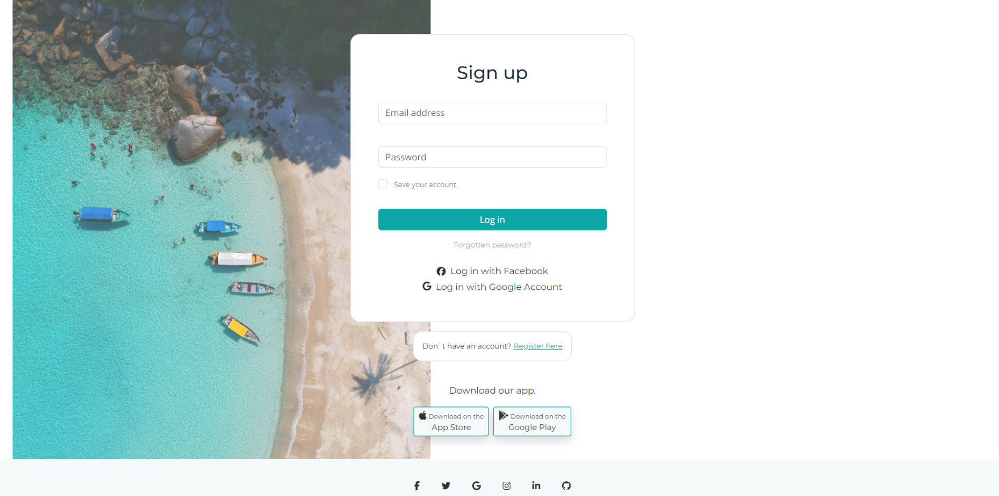
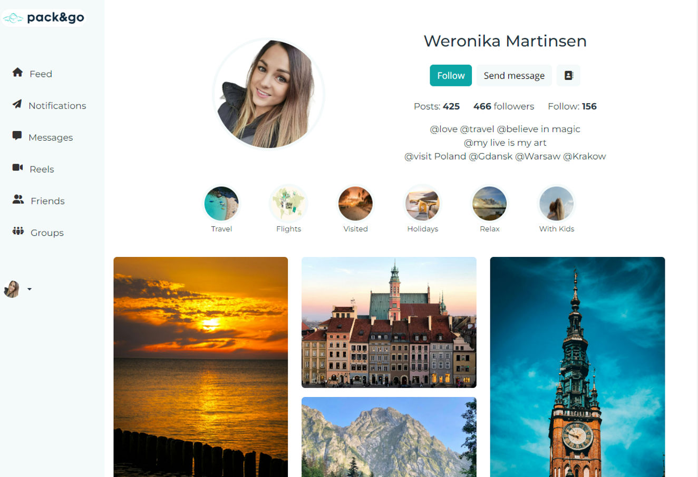
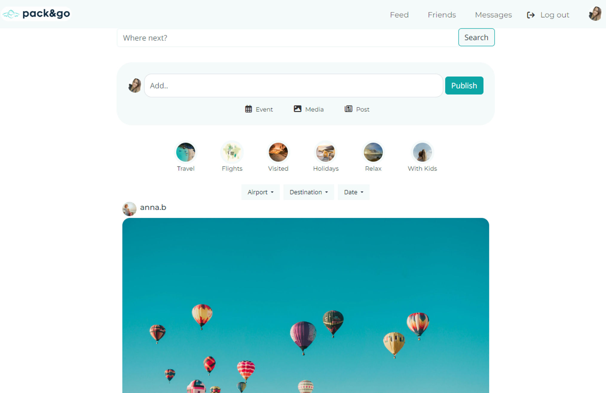

# CSS Frameworks

## "Pack & Go"





Pack & Go is a responsive web application built with Bootstrap and custom Sass, designed to help users plan and organize their travel itineraries efficiently.

## Features

- **User-Friendly Interface:**
- **Bootstrap Integration:**
- **Custom Sass Styles:**
- **HTML Structure:**
- **JavaScript Functionality:**

## Getting Started

### Prerequisites

- Ensure you have [Node.js](https://nodejs.org/) installed.

## Installing

To get started with this project, follow these steps:

1. Clone the repo:

```bash

   git clone https://github.com/WeronikaMartinsen/css-frameworks-ca/tree/css-frameworks

```

2. Install the dependencies:

```bash
npm install bootstrap@5.3.2

```

```bash
npm install live server

```

## Running

3. To run the app, use the following command:

```bash
npm run dev

```

### Usage

1. Open `index.html` in your preferred browser.
2. Explore the application and start planning your travels!

### Custom Sass Styles

Customize the application's styles by modifying the Sass files in the `src/scss/` directory. After making changes, run `npm run build` to compile the Sass into the `dist/css` directory.

## Deployment

This project is deployed on [Netlify](https://pack-and-go-weronika-martinsen.netlify.app/). Check it out [here](YOUR_NETLIFY_DEPLOYMENT_URL).

## Contributing

We welcome contributions! If you'd like to contribute to Pack & Go, please follow these steps:

1. Fork the repository.
2. Create a new branch: `git checkout -b feature/new-feature`.
3. Make your changes and commit them: `git commit -m 'Add new feature'`.
4. Push to the branch: `git push origin feature/new-feature`.
5. Submit a pull request.

## Acknowledgments

- [](https://getbootstrap.com/) Bootstrap for the responsive front-end framework.
- [](https://sass-lang.com/) Sass for the custom styling.
- [](https://developer.mozilla.org/en-US/docs/Web/HTML) HTML for the structured web pages.
- [](https://developer.mozilla.org/en-US/docs/Web/JavaScript) JavaScript for dynamic and interactive features.

# Contact Me

If you have any questions, suggestions, or just want to chat, feel free to reach out to me!

**Email:** [By Email](wb3167@gmail.com)

**LinkedIn:** [Your LinkedIn Profile](https://www.linkedin.com/in/weronika-martinsen-a655a1246/)

Feel free to open issues or pull requests in this repository for any project-related discussions.
